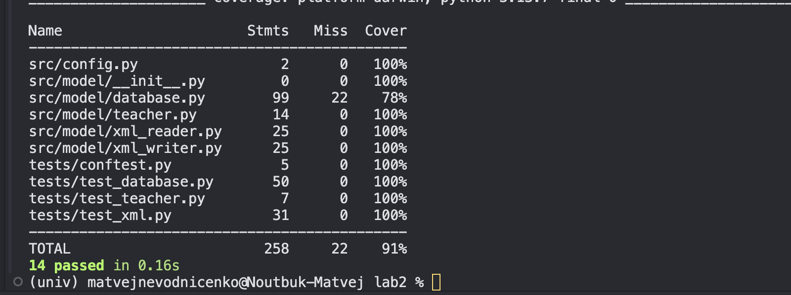

# Лабораторная работа 2

## Назначение
Приложение для учета преподавателей с графическим интерфейсом: добавление, поиск, удаление, просмотр в таблице и дереве, импорт/экспорт XML, постраничный вывод.

## Технологии
- Python
- PyQt6 (GUI)
- SQLite3 (хранение данных)
- XML: `xml.sax` (SAX), `xml.dom.minidom` (DOM)
- pytest + coverage (автотесты и покрытие)

## XML-парсеры
- SAX-парсер: класс `SAXParser` в `src/model/xml_reader.py`, чтение XML в список `Teacher`
- DOM-парсер: класс `DOMParser` в `src/model/xml_writer.py`, генерация XML из записей БД

## Структура и классы

| Файл | Класс/функция | Назначение |
|---|---|---|
| `sem2/lab2/main.py` | `main()` | Точка входа: создание `QApplication`, `MainWindow`, `Database`, `Controller` |
| `sem2/lab2/src/config.py` | константы путей | Пути к `teachers.xml` и `teachers.sqlite3` |
| `sem2/lab2/src/controller/controller.py` | `Controller` | Связь UI и БД, обработка действий меню и диалогов |
| `sem2/lab2/src/model/teacher.py` | `Teacher` | Dataclass модели преподавателя |
| `sem2/lab2/src/model/database.py` | `Database` | CRUD и фильтрация в SQLite |
| `sem2/lab2/src/model/xml_reader.py` | `SAXParser` | Импорт XML через SAX |
| `sem2/lab2/src/model/xml_writer.py` | `DOMParser` | Экспорт XML через DOM |
| `sem2/lab2/src/view/main_window.py` | `MainWindow` | Главное окно, меню, переключение table/tree |
| `sem2/lab2/src/view/table.py` | `Table` | Виджет таблицы преподавателей |
| `sem2/lab2/src/view/pagination.py` | `Pagination` | Пагинация (размер страницы и навигация) |
| `sem2/lab2/src/view/addition_window.py` | `AdditionWindow` | Диалог добавления записи |
| `sem2/lab2/src/view/search_window.py` | `SearchWindow` | Диалог поиска и отображения результатов |
| `sem2/lab2/src/view/delete_window.py` | `DeleteWindow` | Диалог предпросмотра и удаления записей |

## Данные
- `sem2/lab2/data/teachers.sqlite3` — база данных SQLite
- `sem2/lab2/data/teachers.xml` — XML-файл с преподавателями

## Запуск приложения
```bash
cd sem2/lab2
python main.py
```

## Тесты и покрытие
```bash
cd sem2/lab2
pytest -q --cov
```


